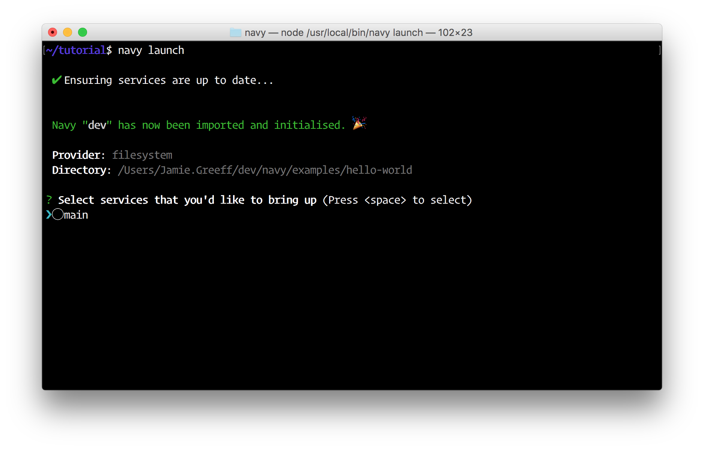
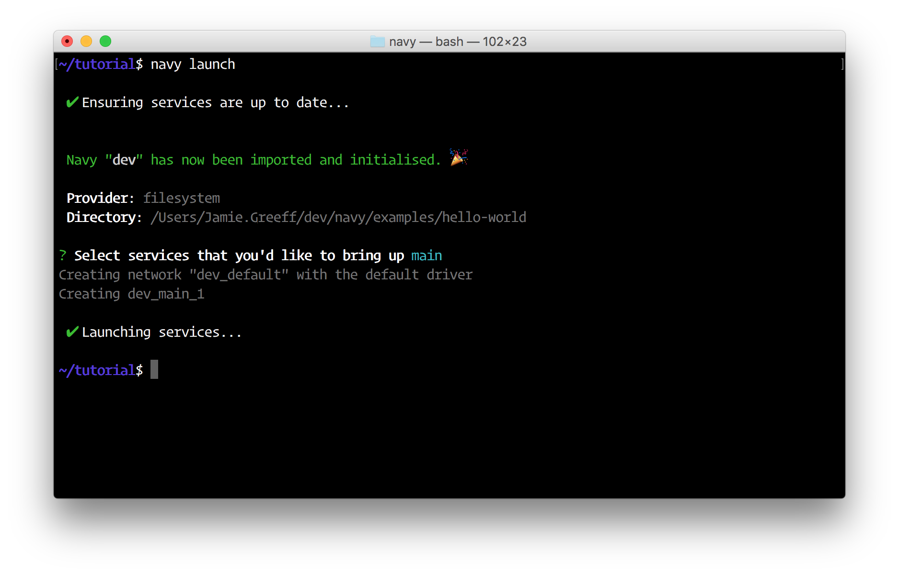
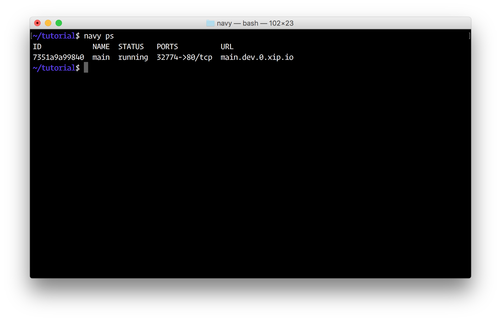
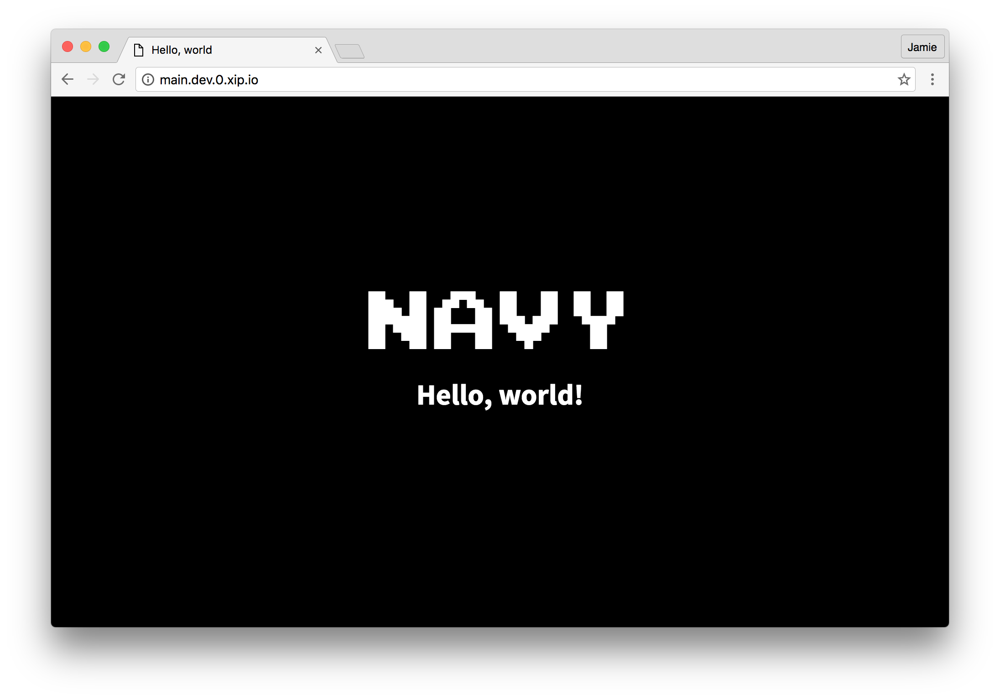

Hello world with Navy
=====================

To start with, we're going to use the `navycloud/hello-world` Docker image to get started with Navy.

Create a new file `docker-compose.yml` with the following:

```yaml
version: '2'

services:
  main:
    image: navycloud/hello-world
    ports:
      - "80"
```

Now from your terminal run:

```sh
$ navy launch
```



Select the `main` service to launch by pressing the space bar and then press enter:



Now run `navy ps`, you should see your service running:



Now open a web browser and go to the URL which `navy ps` shows (<http://main.dev.0.xip.io>). You can also just run `navy open main` as well which will automatically open your browser to the correct URL.




Sorted!
-------

That's the "Hello world" of Navy! Now you'll want to make a `docker-compose.yml` config file for your own application. It's worth noting a few things at this point before you start exploring Navy though:

- #### A "Navy" is global

  When you run `navy launch` and spin up some services, you've created and launched a "Navy".
  Seeing as Navy is designed to make dev lives easier, Navies which are launched are global and can be operated on from any working directory. This is one of the main differences to Docker Compose (You have to be in the same directory as your `docker-compose.yml` file to use Docker Compose).

  When you spin up a Navy, you give it a name which makes it identifiable. By default, Navy uses the name "dev".

  If you want to run multiple Navies on your machine at once, you need to change the name of the Navy that you're operating/launching on. [See working with multiple Navies for more information](4-multiple-navies.md).

- #### Navy automatically allows you to access your services using *.xip.io in the browser

  If you publish port 80 from your service, Navy will automatically provide a URL which you can access the service on without using an IP and random port.

  For more information, [see the Navy HTTP Proxy](../http-proxy.md).

<span class="move-on-link">[Move on to some examples](examples.md)</span>
